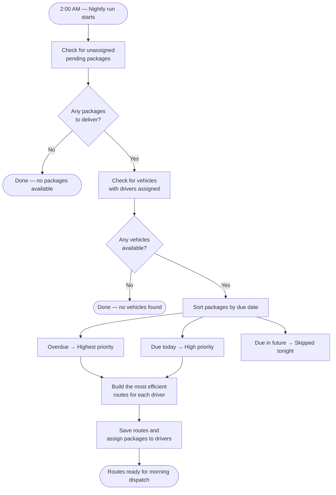

# Dispatch and Operations

Every day, WhenDan automatically plans driver routes so that dispatchers arrive in the morning with assignments already prepared. This page explains what happens, when it happens, and what to expect.

## Daily Route Planning

At approximately **2:00 AM** (local warehouse time), the system runs an automatic route planning process. No action is required from the dispatch team — it runs on its own each night. This is a critical part of our operations, ensuring that drivers have clear routes to follow each day and that time-sensitive deliveries are prioritised.

### What the system looks at

When the nightly process runs, it reviews:

- **Unassigned packages** — any package that is in a *Pending* status and has not yet been placed on a route.
- **Active vehicles and drivers** — any vehicle that currently has a driver assigned to it.

### Which packages are included

Not all pending packages are included in each night's plan:

| Package due date | What happens |
|---|---|
| Overdue (past due) | Included — given the **highest** priority |
| Due today | Included — given **high** priority |
| Due in the future | **Not included** — will be planned on a later night |

This ensures that urgent deliveries are always assigned first.

### How routes are assigned

Route planning is powered by [OpenRouteService](https://openrouteservice.org/), a mapping service that calculates the most efficient order of stops using real road networks. The system groups packages into the most efficient routes it can, taking into account each vehicle's capacity and the locations of all delivery stops. Each driver is assigned a route that starts and ends at the warehouse.

Each stop includes approximately **15 minutes** of service time for the driver to complete the delivery.

### What happens if something is missing

- If there are **no packages** to assign that morning, the process finishes without creating any routes and logs a note that no packages were available.
- If there are **no vehicles or drivers** available, the process also stops and logs that no vehicles were found.

Dispatchers should ensure that driver-vehicle assignments are up to date before the nightly run to avoid gaps in coverage.

## What Dispatchers See in the Morning

After the nightly run completes, each assigned driver will have a route ready with an ordered list of stops. Dispatchers can review these routes, check for any unassigned packages, and make manual adjustments if needed before the day begins.

## Operational Goals

- Overdue and time-sensitive packages are prioritised every night
- Vehicles are loaded as efficiently as possible
- Drivers start the day with a clear, ordered route
- Dispatch teams have visibility into assignments before the morning briefing
